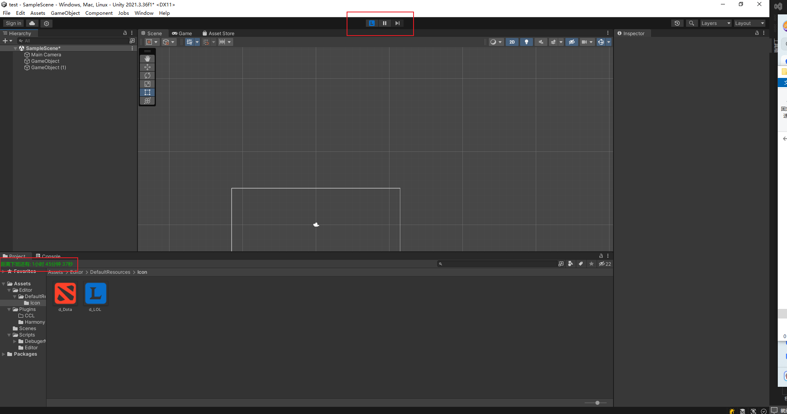

# Detour
通过函数指针替代，hook修改unity编辑器界面

提供脚本示例，可快速上手。

来自:

[Detours：在运行时重定向 C# 方法](https://tryfinally.dev/detours-redirecting-csharp-methods-at-runtime)

[Unity源码](https://github.com/Unity-Technologies/UnityCsReference)
